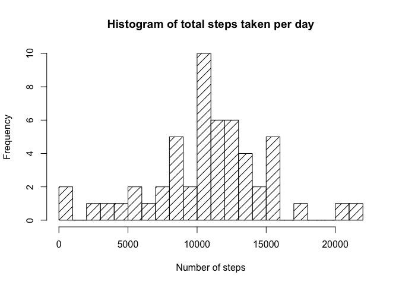
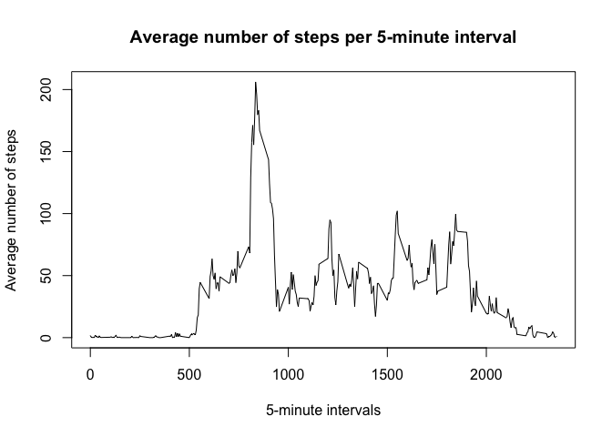
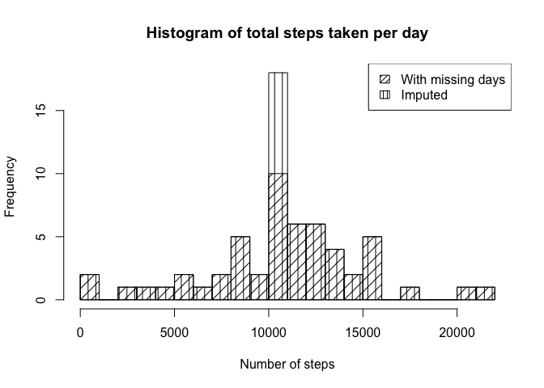
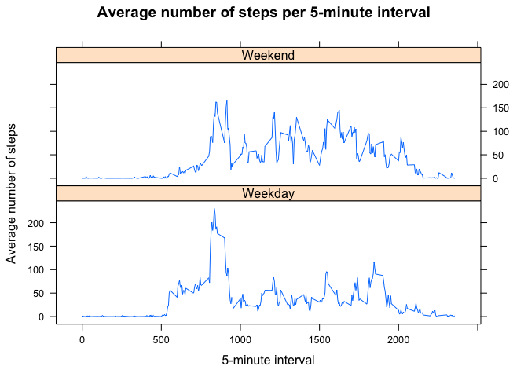

## Synopsis

This is a student submission for **Peer-graded Assignment: Course Project 1** of the **Reproducible Research** course

## Source Data

Raw data is provided alonside this R markdown file as a zip file named *activity.zip*  
It has been taken from a personal activity monitoring device. This device collects data at 5 minute intervals through out the day. The data consists of two months of data from an anonymous individual collected during the months of October and November, 2012 and include the number of steps taken in 5 minute intervals each day.

The variables included in this dataset are:  
1. steps: Number of steps taking in a 5-minute interval  
2. date: The date on which the measurement was taken in YYYY-MM-DD format  
3. interval: Identifier for the 5-minute interval in which measurement was taken

The dataset is stored in a zipped, comma-separated-value (CSV) format and there are a total of 17,568 observations in this dataset.

## Loading and preprocessing the data

Unzip the source data file and load it using read.csv


```r
unzip("activity.zip")
data <- read.csv("activity.csv")
```

## What is mean total number of steps taken per day?

The steps are grouped by date and summed to get the total steps per day. And then, the mean and median are calculated.


```r
sum_steps_by_dates <- aggregate(steps ~ date, data, sum)
mean_steps <- mean(sum_steps_by_dates$steps)
median_steps <- median(sum_steps_by_dates$steps)
```

Next, a Histogram of the total number of steps taken each day is drawn.


```r
hist(sum_steps_by_dates$steps, xlab="Number of steps", ylab="Frequency", main="Histogram of total steps taken per day", density=10, angle=45, breaks=20)
```

<!-- -->

**Conclusion:**  
**Mean** steps per day is **10766.19**  
**Median** steps per day is **10765.**  

## What is the average daily activity pattern?

The steps are grouped by 5-minute intervals and their mean is calculated over all days.


```r
mean_steps_by_intervals <- aggregate(steps ~ interval, data, mean)
max_interval <- mean_steps_by_intervals[which.max(mean_steps_by_intervals$steps),1]
```

Next, a time series plot of the 5-minute interval (x-axis) and the average number of steps taken, averaged across all days (y-axis), is generated.


```r
plot(mean_steps_by_intervals$interval, mean_steps_by_intervals$steps, type="l", xlab="5-minute intervals", ylab="Average number of steps", main="Average number of steps per 5-minute interval")
```

<!-- -->

**Conclusion:**
The 5-minute interval, which on average, contains the **maximum** number of steps is **835**  

## Imputing missing values

Missing values in steps column are limited to 8 wholly missing dates. All 288 intervals of each of the days are missing.


```r
na_data <- data[is.na(data$steps),]
na_days <- aggregate(interval ~ date, na_data, length)
na_days
```

```
##         date interval
## 1 2012-10-01      288
## 2 2012-10-08      288
## 3 2012-11-01      288
## 4 2012-11-04      288
## 5 2012-11-09      288
## 6 2012-11-10      288
## 7 2012-11-14      288
## 8 2012-11-30      288
```

The missing days are imputed with the average day taken from the `mean_steps_by_intervals` from the earlier stage and rouding to the nearest integer.


```r
rounded_mean_steps_by_intervals <- transform(mean_steps_by_intervals, steps=round(steps))
whole_days <- subset(data, !date %in% lapply(na_days$date, as.character))
for(day in na_days$date) {
    imputed_day <- rounded_mean_steps_by_intervals
    imputed_day$date <- as.factor(day)
    whole_days <- rbind(imputed_day, whole_days)
}
```

The total steps by date and the mean and median days are recalculated.


```r
sum_steps_by_imputed_dates <- aggregate(steps ~ date, whole_days, sum)
mean_imputed_steps <- mean(sum_steps_by_imputed_dates$steps)
median_imputed_steps <- median(sum_steps_by_imputed_dates$steps)
```

The new imputed Histogram of the total number of steps taken each day is drawn over the previous histogram for comparison.


```r
hist(sum_steps_by_imputed_dates$steps, xlab="Number of steps", ylab="Frequency", main="Histogram of total steps taken per day",density=10, angle=90, breaks=20)
hist(sum_steps_by_dates$steps, density=10, angle=45, breaks=20, add=TRUE)
legend("topright", legend=c("With missing days", "Imputed"), density=c(20,20), angle=c(45,90))
```

<!-- -->

**Conclusion:**  
**Mean** steps per day after imputing is **10765.64** as ooposed to the old value of **10766.19**  
**Median** steps per day after imputing is **10762** as ooposed to the old value of **10765.**  

## Are there differences in activity patterns between weekdays and weekends?

The days of the week are infered from the imputed data and a new factor called `day_of_week` is added to indicate `Weekend` and normal `Weekday`. Next, the steps are grouped by 5-minute intervals and their mean is calculated over all days grouped by the `day_of_week` factor.


```r
weekend <- c("Saturday", "Sunday")
whole_days$day_of_week = as.factor(ifelse(weekdays(as.Date(whole_days$date, tz="UTC")) %in% weekend, "Weekend", "Weekday"))
steps_by_interval_by_day_of_week <- aggregate(steps ~ interval + day_of_week, whole_days, mean)
```

A panel plot containing a time series plot of the average number of steps taken, averaged across all weekday days or weekend days, is generated.


```r
xyplot(steps_by_interval_by_day_of_week$steps ~ steps_by_interval_by_day_of_week$interval | steps_by_interval_by_day_of_week$day_of_week, main="Average number of steps per 5-minute interval", xlab="5-minute interval", ylab="Average number of steps", layout=c(1,2), type="l")
```

<!-- -->

**Conclusion:** There are more steps on the weekends as opposed to the weekdays.
